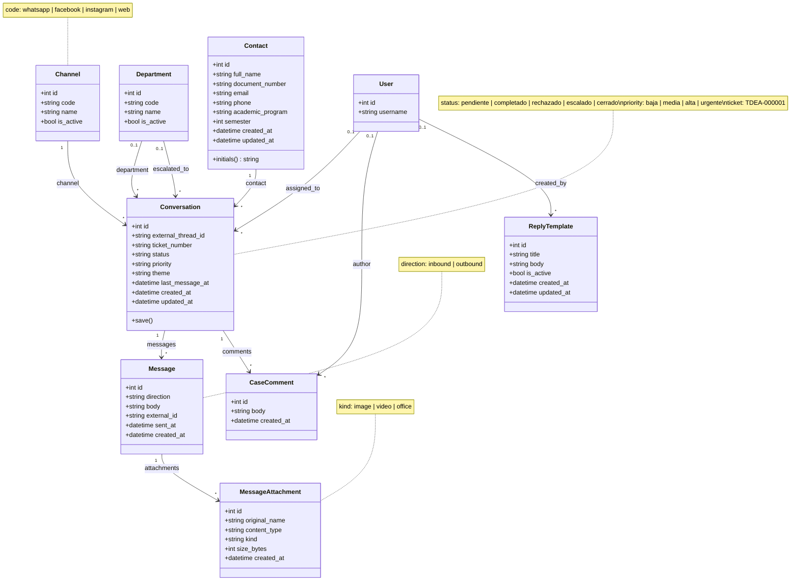
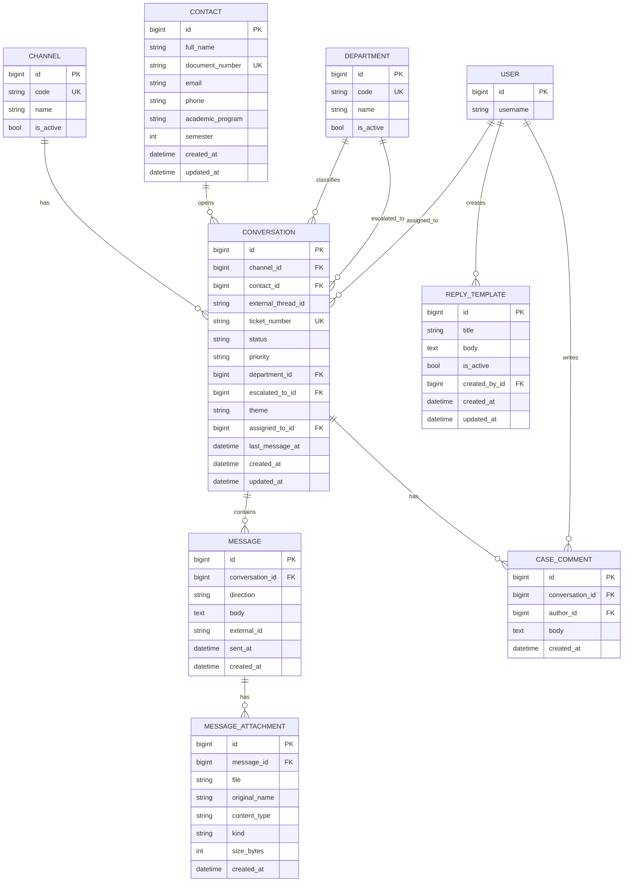

# Módulo `cases` — Diagrama de clases y entidad-relación

Documento único con el modelo de dominio de la app **cases** (Punto TdeA / HU-01 + acciones de caso).

---

## 1. Diagrama de clases

---

## 2. Diagrama entidad-relación

---

## 3. Cardinalidades (resumen)

| Relación | Cardinalidad | Notas |
|----------|--------------|--------|
| Channel → Conversation | 1:N | `PROTECT` |
| Contact → Conversation | 1:N | `PROTECT` |
| Department → Conversation (clasificación) | 0..1:N | `SET_NULL` |
| Department → Conversation (escalado a) | 0..1:N | obligatorio si `status=escalado` |
| User → Conversation (asesor) | 0..1:N | `assigned_to` |
| Conversation → Message | 1:N | chat ciudadano |
| Conversation → CaseComment | 1:N | comentarios internos |
| Message → MessageAttachment | 1:N | imagen / video / ofimática |
| User → CaseComment | 0..1:N | autor del comentario |
| User → ReplyTemplate | 0..1:N | plantillas predefinidas del clip |

---

## 4. Implementación

Código fuente: [`cases/models.py`](models.py)
